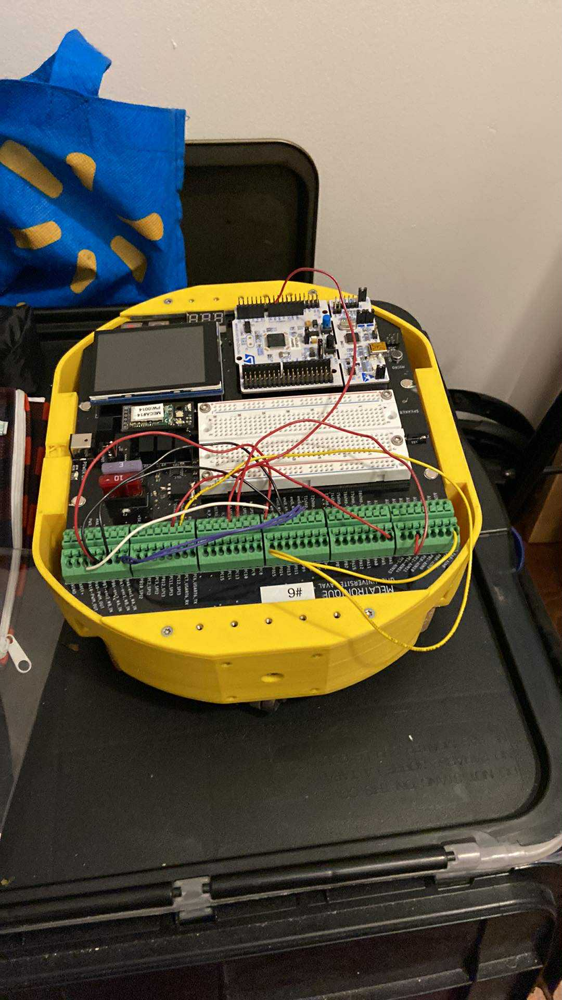

Projets pour le cours de mécatronique appliquée à l'automne 2025.

Le robot et les branchemnsts internes sont fournis. La plateforme est nucleo stm32 f446re, programmé en C.
()

Écran tactile TFT, 2 moteur DC servo Maxon 110960, 2 encodeurs, amplificateurs opérationnels, lien sériel USART (bluetooth, terminal, écran), mémoire FLASH, ponts H, cpateur à effet Hall, circuit de commande MOSFET, transistors, moteur à pas 

Tous les projets sont programmés avec un code en temps réel. Pour le premier, une partie utilisait les registre sans utiliser la librairie HAL

Projet 1 - Alarme de voiture à activation différée (aucun vidéo associé)
Détection au toucher d'une petite voiture de style hot wheels;
L'alarme se déclenche lors de 2 touchers consécutifs à l'intérieur de 10 secondes, et affiche un message à l'écran.

Projet 2 - Odomètre de vélo (aucun vidéo associé)
Affichage à l'écran de la distance parcourue de la roue, la puissance instantannée, le temps de parcours, etc.
Enregistrement des valeurs en mémoire FLASH DATA.

Projet 3 - Traqueur pour orientation de panneau solaire ()
Affichage à l'écran de l'orientation du panneau (initialisation à l'est);
Moteur à pas;
Contrôle doux pour éviter de sauter des pas lors de l'orientation (accélération et vitesse maximale déterminée).

Projet 4 - Contrôle d'un moteur DC-servo en position ()
Affichage à l'écran d'un bouton pour contrôler l'orientation d'une roue sur 720 degrés;
Contrôle avec PID et accélération/déccélération pour limiter le courant.

Projet 5 - Contrôle d'un véhicule avec PID vitesse/position couplé ()
Pige au hasard d'une cible finale;
La cible est envoyée au robot (bluetooth) et celui-ci doit y aller, faire une rotation de 180 degré au dessus, et revenir pointer la cible de départ;
La seule commande envoyée est le numéro de la cible.

Projet final - Transpalette ()
Doit éviter un robot qui suit un parcours prédéterminé;
Les 3 palettes peuvent être à 2 positions différentes sur chaque coins, inconnues du robot au départ;
Le robot peut s'orienter avec les bandes noires, 3 capteurs de proximité et un PID vitesse/position avec encodeur sur chaque roue;
Doit ramasser les 3 palettes, les empiler au centre et revenir au point de départ;
Le vidéo est d'une équipe similaire, celui de notre équipe étant de basse qualité.
